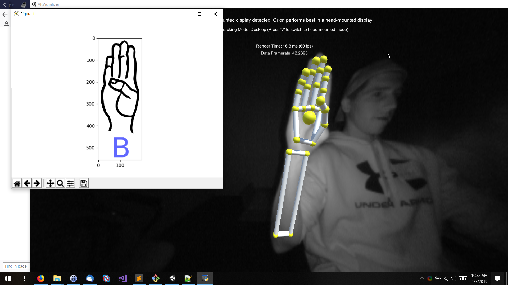

# What it does
Interprets ASL hand shapes and translates them to written English.
# How we built it
Hand, finger and joint orientation is read in real time using a Leap Motion. This data is then fed into a neural network that we trained to classify different ASL signs based on the input vectors. Each 'frame' is ran through 5 machine learning algorithms, and each produces candidate a letter classification. The letter that was selected the most often by the 5 algorithms is then selected as the final result.
# ML algorithms used for classifications
 - Logistical Regression
 - Linear Discriminant Analysis
 - KNN
 - Decision Tree Classifier
 - Gaussian Naive Bayes
# Python libraries required
 - sklearn
 - pandas
 - numpy
 - matplotlib
 - scipy
# Challenges we ran into
Depending on the ASL sign that is chosen, much of the hand/fingers can be hidden from the view of a single sensor. Using multiple sensors, placed at different angles around the hand would have led to more inputs into our neural network and thus more accurate interpretations.
